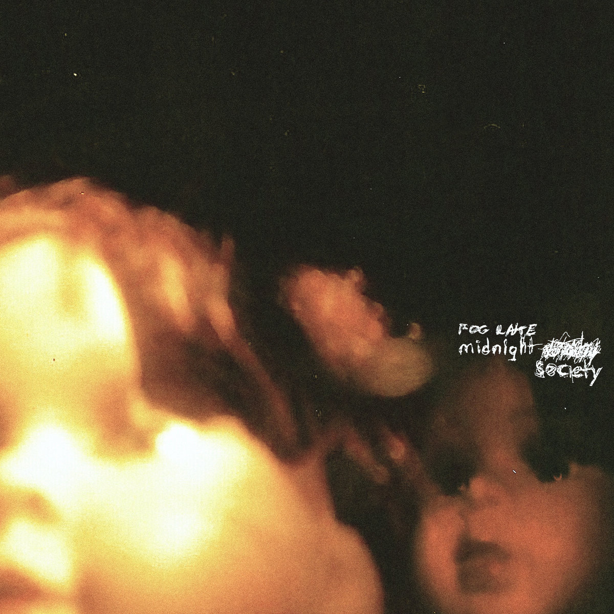

Bandcamp Friday is March 7th, 2025. I always like to use these opportunities to both find/support Creative Commons music and thought I'd start sharing some of my picks.

If you're interested in CC music, be sure to checkout the tool I made for finding CC music on BC: [cc-bc](https://handeyeco.github.io/cc-bc/).

## midnight society by Fog Lake

Moody and mellow bedroom pop from Canada, **midnight society** reminds me of a more lo-fi Mac DeMarco or a more peppy Sparklehorse. Dreamy, whispery, and melancholic.

- [Bandcamp link](https://foglake.bandcamp.com/album/midnight-society-3)
- Released in 2023
- [CC BY](https://creativecommons.org/licenses/by/3.0/)

## Dollar Store Disco by ZINNIA

More music from Canada, **Dollar Story Disco**'s upbeat, danceable music belies its often bittersweet lyrics. Reminiscent of Julia Jacklin in Phantastic Ferniture.

- [Bandcamp link](https://this-is-zinnia.bandcamp.com/album/dollar-store-disco)
- Released in 2025
- [CC BY-NC-ND](https://creativecommons.org/licenses/by-nc-nd/3.0/)

## Electric Voyeur by Big Blood

Close to the border of being too avant-garde for my tastes, I have to add **Electric Voyeur** for expertly balancing the experimental with the musical. I was torn between listing this album or [First Aid Kit](https://dontrustheruin.bandcamp.com/album/first-aid-kit); both are worth your time. Listening to Big Blood I feel both pushed away and held close.

- [Bandcamp link](https://dontrustheruin.bandcamp.com/album/electric-voyeur)
- Released in 2024
- [CC BY-NC-ND](https://creativecommons.org/licenses/by-nc-nd/3.0/)
