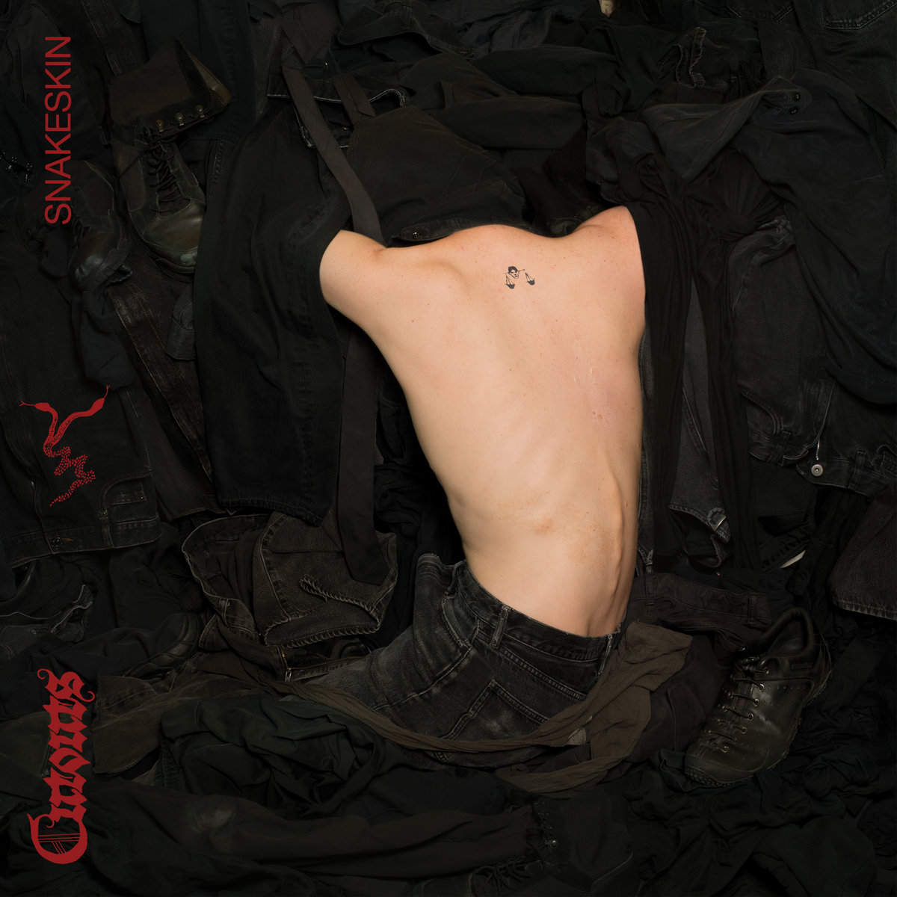
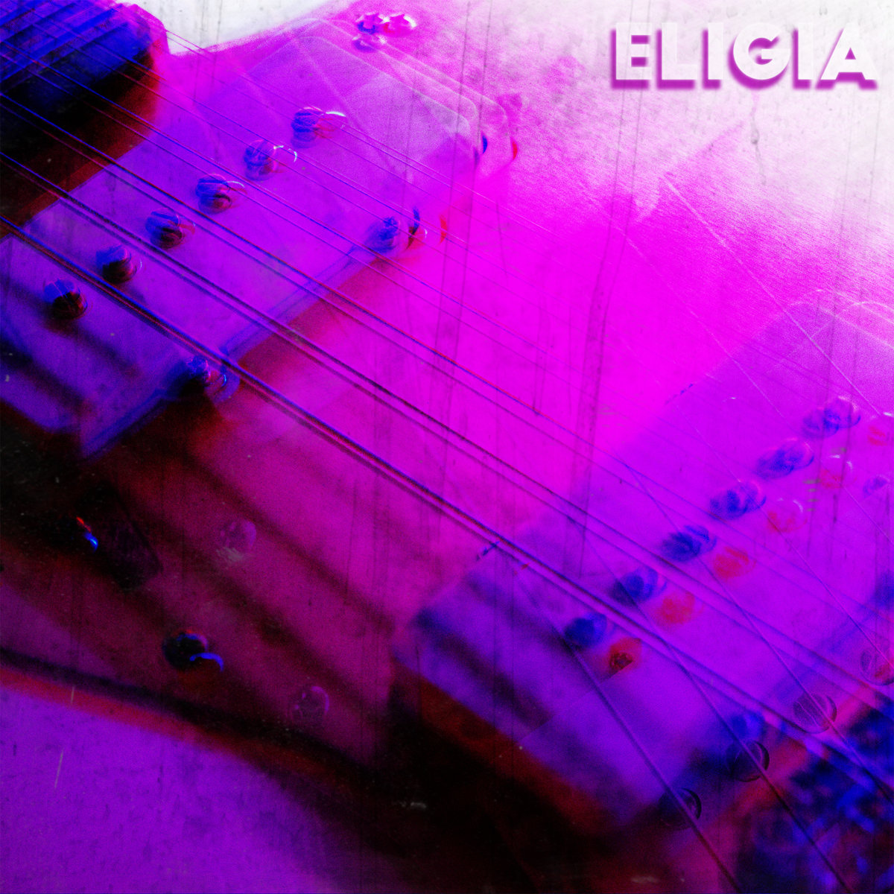

Bandcamp Friday is May 2nd, 2025. I always like to use these opportunities to both find/support Creative Commons music and thought I'd start sharing some of my picks.

If you're interested in CC music, be sure to checkout the tool I made for finding CC music on BC: [cc-bc](https://handeyeco.github.io/cc-bc/).

## Snakeskin by cutouts

Dark yet catchy, **Snakeskin** melds drum machines and synthesizers with guitars and silky vocals to create danceable, industrial-tinged post-punk.

- [Bandcamp link](https://cutouts.bandcamp.com/album/snakeskin)
- Released in 2025
- [CC BY-NC-ND](https://creativecommons.org/licenses/by-nc-nd/3.0/)

## Eligia by Archie Sagers

Reminds me of lofi version of The Cure or The Feelies if they had made shoegaze. **Eligia** layers nervous vocals over swirling guitars over upbeat drums.

- [Bandcamp link](https://craftingroomrecordings.bandcamp.com/album/eligia)
- Released in 2020
- [CC BY-NC-SA](https://creativecommons.org/licenses/by-nc-sa/3.0/)

## Daylight by TW Walsh

A fun find, **Daylight** puts vocals that sound like they could easily fit on a Nashville pop country song on top of dreamy electronica. Introspective music to bob your head to.

- [Bandcamp link](https://twwalsh.bandcamp.com/album/daylight)
- Released in 2022
- [CC BY-NC-ND](https://creativecommons.org/licenses/by-nc-nd/3.0/)

## Collage by little losses

Glitchy but chill, **Collage** is the perfect music for driving a convertible by the beach on an alien planet in the year 3025.

- [Bandcamp link](https://littlelosses.bandcamp.com/album/collage)
- Released in 2025
- [CC BY-NC-SA](https://creativecommons.org/licenses/by-nc-sa/3.0/)
