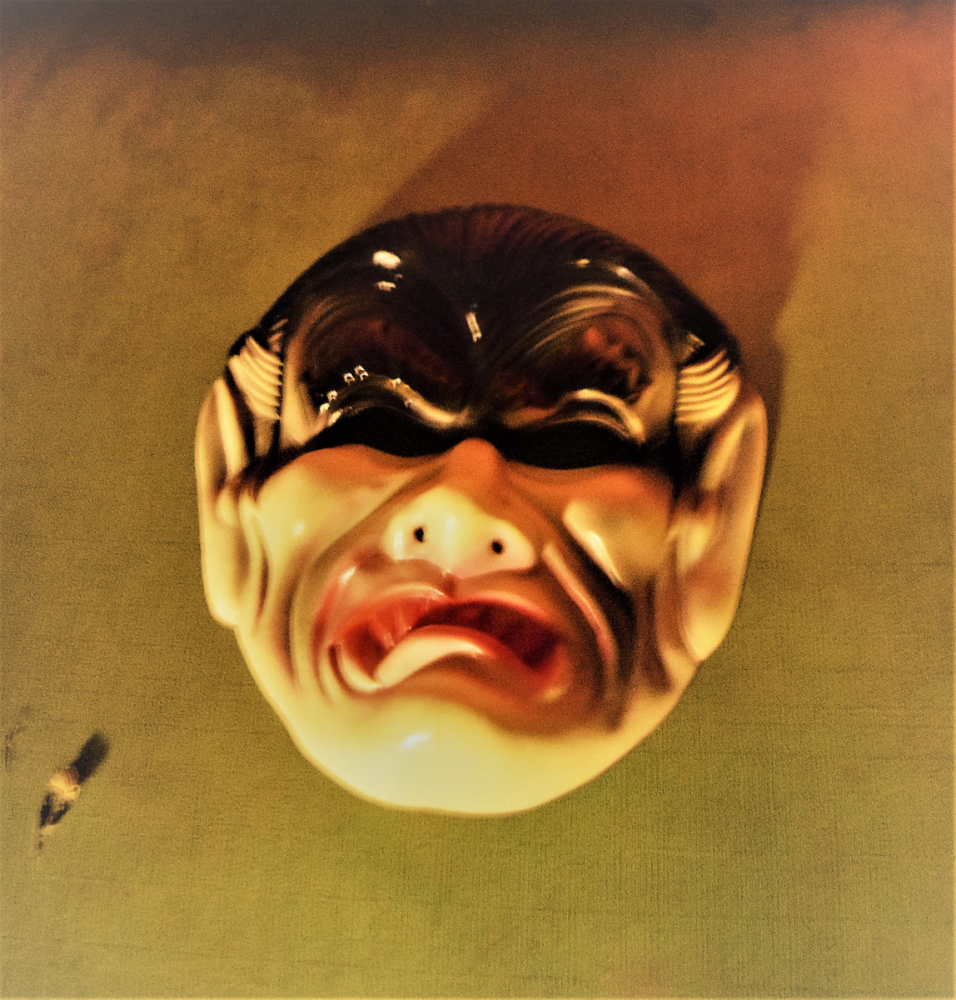

Bandcamp Friday is August 1st, 2025. I always like to use these opportunities to both find/support Creative Commons music and thought I'd start sharing some of my picks.

If you're interested in CC music, be sure to checkout the tool I made for finding CC music on BC: [cc-bc](https://handeyeco.github.io/cc-bc/).

## Little Miss Echo by Little Miss Echo

**Little Miss Echo** is the kind of find that makes me excited about digging through Bandcamp. Like listening to elevator music of 60s pop having a head-on collision with electronic tinged bedroom pop. It's just fun.

- [Bandcamp link](https://echomisslittle.bandcamp.com/album/little-miss-echo)
- Released in 2024
- [CC BY-NC](https://creativecommons.org/licenses/by-nc/3.0/)

## Vampire Hours by The Humms

Noisy and frantic, **Vampire Hours** blatently pulls from West Coast neo-psychedlic bands like Fuzz and Osees but somehow manages make things even weirder? Minute-by-minute it jumps from garage to bossa nova to Bowie-esque pop on a roller coaster of genre explorations.

- [Bandcamp link](https://gypsyfarmrecords.bandcamp.com/album/vampire-hours)
- Released in 2020
- [CC BY-NC-ND](https://creativecommons.org/licenses/by-nc-nd/3.0/)

## Spill by ELLiS·D

Listening to **Spill**, I'm not sure whether I should be dancing or moshing but I feel like I _need to move_. Upbeat post-punk with urgent, often to a point of desperation, vocals.

- [Bandcamp link](https://craftingroomrecordings.bandcamp.com/album/spill)
- Released in 2025
- [CC BY-NC-ND](https://creativecommons.org/licenses/by-nc-nd/3.0/)
