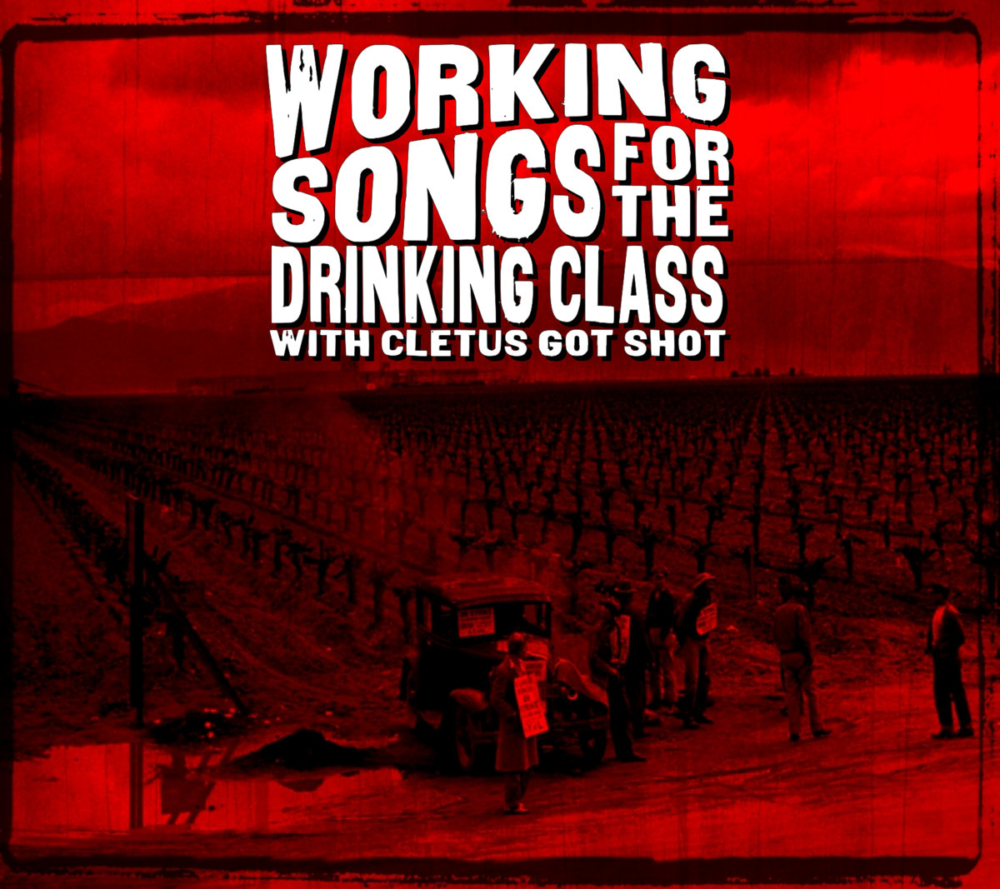
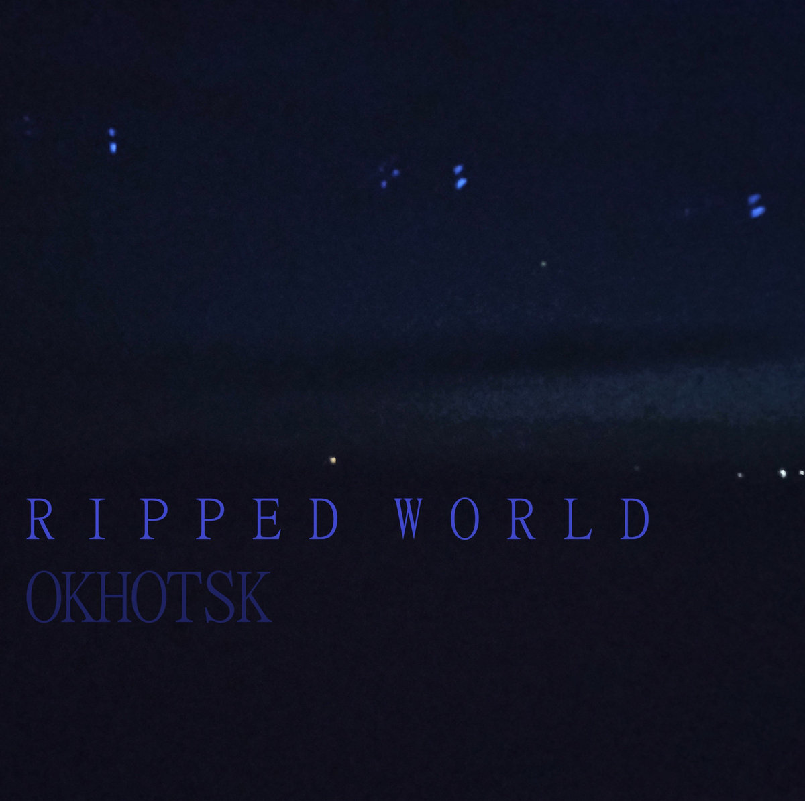

Bandcamp Friday is October 3rd, 2025. I always like to use these opportunities to both find/support Creative Commons music and thought I'd start sharing some of my picks.

If you're interested in CC music, be sure to checkout the tool I made for finding CC music on BC: [cc-bc](https://handeyeco.github.io/cc-bc/).

I decided to do another regional theme, but this time focusing on music local to me: CC music from Fayetteville, AR.

## Ursa Major by Major Urges

Such an awesome find - upbeat and urgent music that blends the attitude of garage revival with the sounds of early internet bedroom post-punk. **Ursa Major** makes me feel like I'm alternating between listening to a friend jam in his garage and rocking out at the best local show I've ever been to.

- [Bandcamp link](https://major-urges.bandcamp.com/album/ursa-major)
- Released in 2014
- [CC BY-NC](https://creativecommons.org/licenses/by-nc/3.0/)

## Working Songs for the Drinking Class by Cletus Got Shot

**Working Songs for the Drinking Class** is super fun folk punk that makes you want to chug a pint before overthrowing the capitalist machine. Makes me wonder what Pete Seeger would sound like if he existed in the same era as Flogging Molly.

- [Bandcamp link](https://cletusgotshot.bandcamp.com/album/working-songs-for-the-drinking-class)
- Released in 2012
- [CC BY-NC-SA](https://creativecommons.org/licenses/by-nc-sa/3.0/)

## Ripped World by Okhotsk

Built on a bedrock of head bobbing beats with layers of unique, textural synths, **Ripped World** bounces around and subverts recognizable EDM/IDM genres. You're never able to predict what the next song is going to be like as Okhotsk continuously explores new sonic territory.

- [Bandcamp link](https://jlafargue.bandcamp.com/album/ripped-world)
- Released in 2025
- [CC BY](https://creativecommons.org/licenses/by/3.0/)
