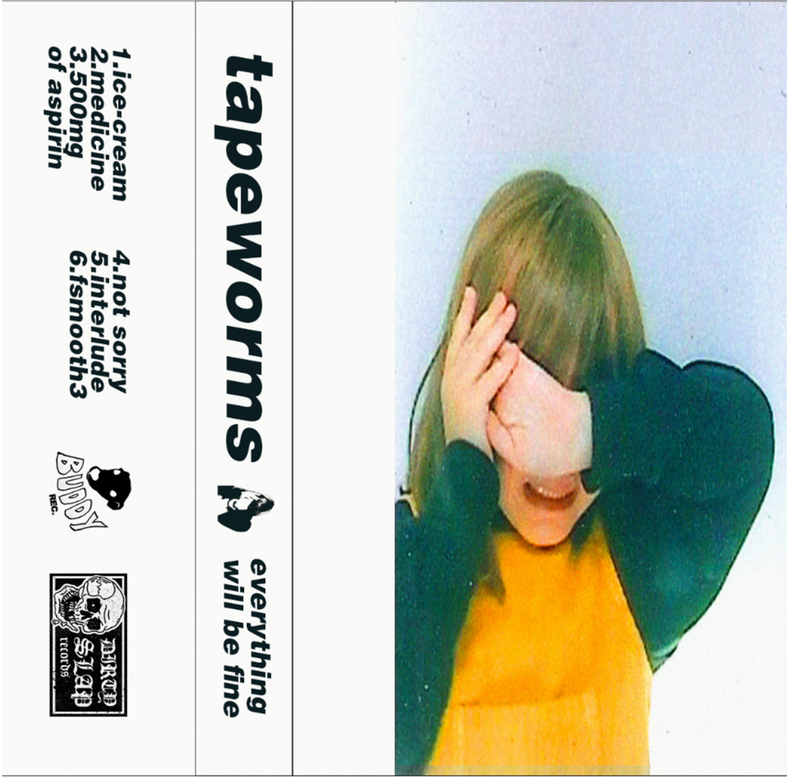
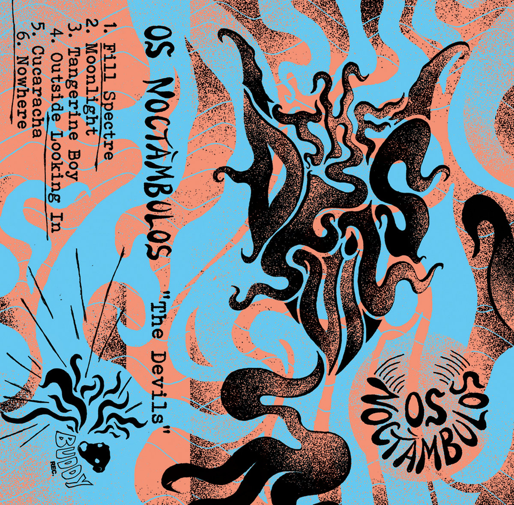
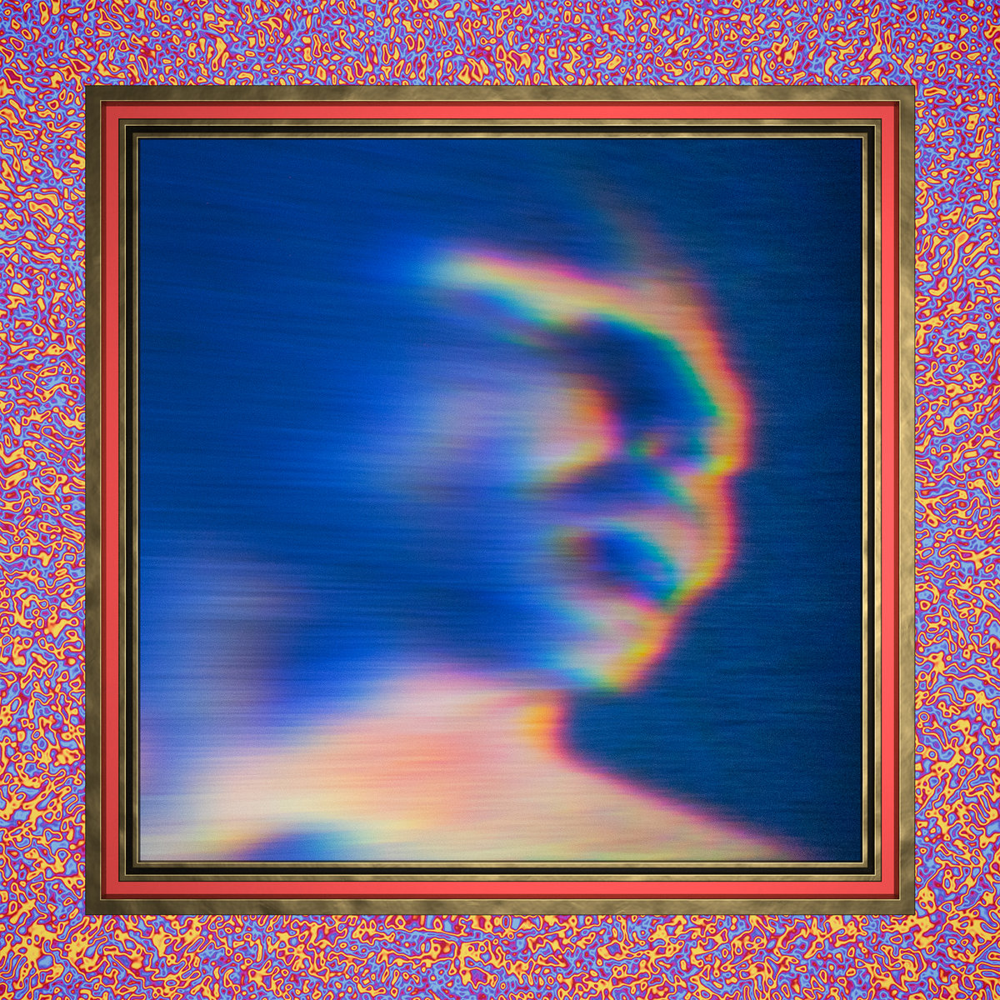

Bandcamp Friday is December 5th, 2025. I always like to use these opportunities to both find/support Creative Commons music and thought I'd start sharing some of my picks.

It kind of caught me off-guard this time; for some reason I was confident it was next week. Doesn't matter - I turned on the crawler, collected over 1.5k new CC album links on Bandcamp, and picked three albums that I'm planning on buying.

If you're interested in CC music, be sure to checkout the tool I made for finding CC music on BC: [cc-bc](https://handeyeco.github.io/cc-bc/).

## Everything Will Be Fine by Tapeworms

Two of today's picks are off of Buddy Records. **Everything Will Be Fine** is the perfect shoegaze listen - it's noisy, swirling, and frantic. The vocals sound earnest yet nonchalant and blend effortlessly into the haze of distorted guitars and electronic beats without getting lost.

- [Bandcamp link](https://buddyrecords.bandcamp.com/album/everything-will-be-fine)
- Released in 2018
- [CC BY](https://creativecommons.org/licenses/by/3.0/)

## The Devils by Os Noctambulos

The second album from Buddy Records, **The Devils** is jangly and folksy. At times Os Noctambulos seems to be pulling from '60s psych/garage and at others they seem more akin to neo-psych, bordering on lofi surf rock. Either way, the whole album is raw and excitingly real.

- [Bandcamp link](https://buddyrecords.bandcamp.com/album/the-devils)
- Released in 2017
- [CC BY](https://creativecommons.org/licenses/by/3.0/)

## Snuff by Secret Knives

For a second **Snuff** had me really interested in doing a New Zealand post, but I ran out of time. Delightful indie pop that's often upbeat and always a little off the beaten path. I think Secret Knives is doing a great job at capturing what makes music fun while also taking big swings with sonic exploration.

- [Bandcamp link](https://secretknives.bandcamp.com/album/snuff)
- Released in 2019
- [CC BY-NC-ND](https://creativecommons.org/licenses/by-nc-nd/3.0/)
