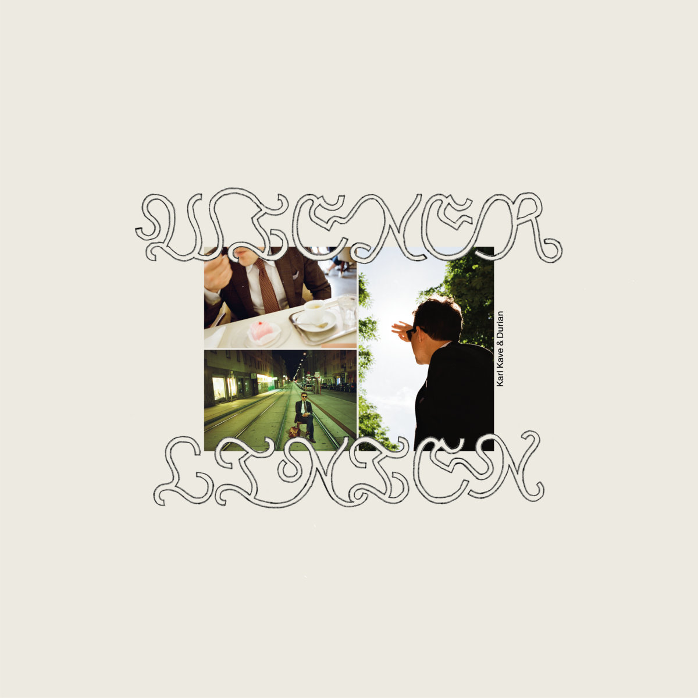
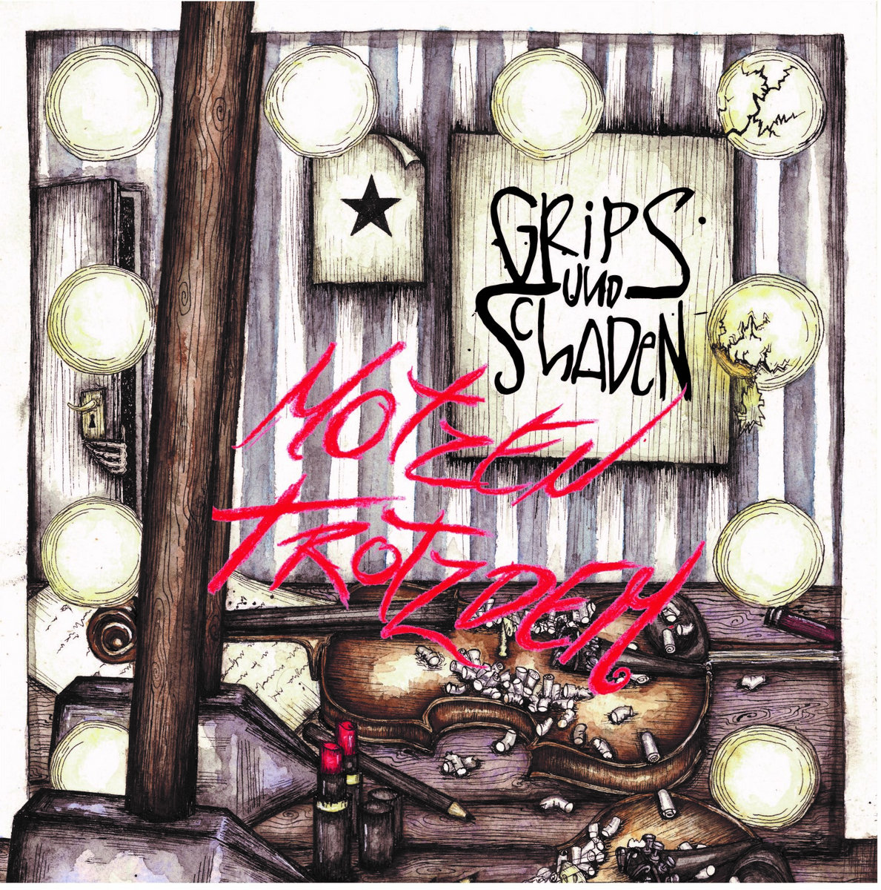
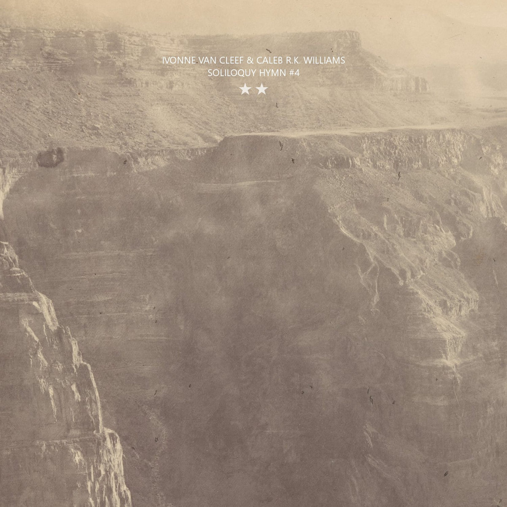

Bandcamp Friday is March 5th, 2026. I always like to use these opportunities to both find/support Creative Commons music and thought I'd start sharing some of my picks.

I've been doing a lot of work recently on my Creative Commons crawler for Bandcamp - I recently backfilled to remove links that result in 404s and I completely rewrote the crawler. Things seem to be going good although the crawler seems to really like [Harsh Noise Wall](https://en.wikipedia.org/wiki/Harsh_noise#Harsh_noise_wall) which I'm not really into.

If you're interested in CC music, be sure to checkout the tool I made for finding CC music on BC: [cc-bc](https://handeyeco.github.io/cc-bc/).

## Wiener Linien by Karl Kave & Durian

Close, talk-singing vocals over rhythmic beats and vintage sounding synth pads, **Wiener Linien** is post-punk / new wave group hailing from Switzerland. **Wiender Linien** is polished and dreamy, but I would also recommend checking out their album **La Vida Loca / Gurkensalat** (also BY-NC-SA) which is much more raw - reminding me of Suicide and Escape-ism.

- [Bandcamp link](https://karlkavedurian.bandcamp.com/album/wiener-linien)
- Released in 2024
- [CC BY-NC-SA](https://creativecommons.org/licenses/by-nc-sa/4.0/)

## Motzen Trotzdem by Grips und Schaden

One of the things I love about crawling Creative Commons albums is finding the Anarchist punk groups from around the world. In this case it's more Anarchist...folk polka? **Motzen Trotzdem** by Germany's Grips und Schaden makes me think of malty beers in steins and singing along with the band at the bar - fun, loud, rowdy.

- [Bandcamp link](https://gripsundschaden.bandcamp.com/album/motzen-trotzdem-2)
- Released in 2022
- [CC BY-NC-ND](https://creativecommons.org/licenses/by-nc-nd/4.0/)

## Soliloquy Hymn #4 by Caleb R.K. Williams & Ivonne Van Cleef

This one's a weird one - how about some LoFi, ambient, improvisational, western music. Well Ivonne Van Cleef has plenty to choose from. In a collaboration with Caleb R.K. Williams, **Soliloquy Hymn #4** sounds like something an archivist might find while digging through old reel-to-reel soundtrack recordings found in some dusty Hollywood closet.

- [Bandcamp link](https://ivonnevancleef.bandcamp.com/album/soliloquy-hymn-4)
- Released in 2024
- [CC BY-NC-ND](https://creativecommons.org/licenses/by-nc-nd/4.0/)

Huh, just realized all the picks have either "und" or "&" in the artist name...

Some honorable mentions:

- [Unitopians by Wombs](https://wombs.bandcamp.com/album/unitopians)
- [Pacification by Wanda & Nova deViator](https://wndv.bandcamp.com/album/pacification)
- [La religión de los árboles by Benigno Lunar](https://benignolunar.bandcamp.com/album/la-religi-n-de-los-rboles)
- [Speedracer 7" by Jenifer Convertible](https://lennyzenith.bandcamp.com/album/jenifer-convertible-speedracer-7)
