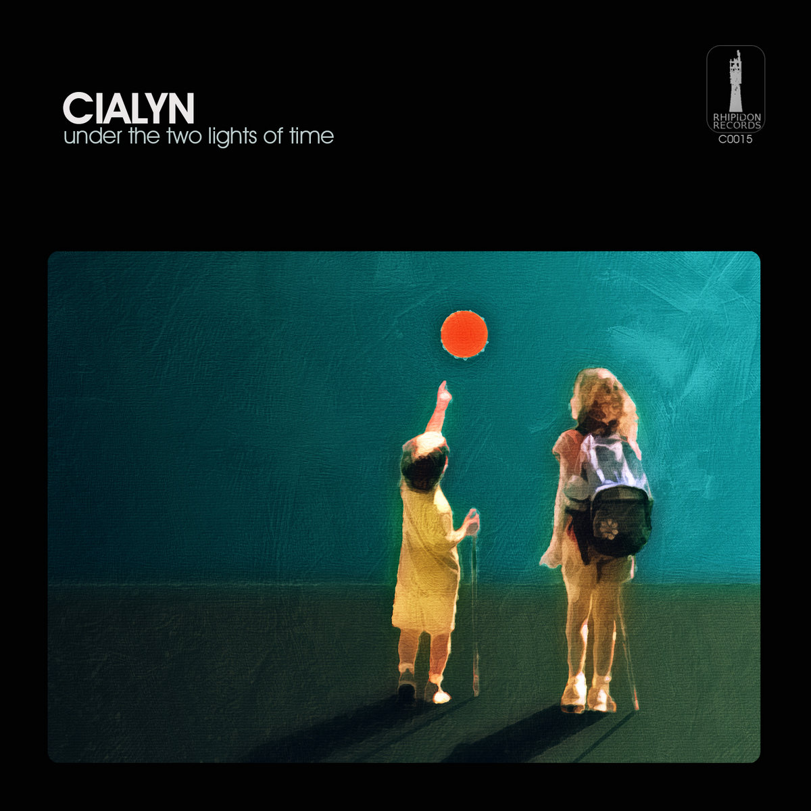
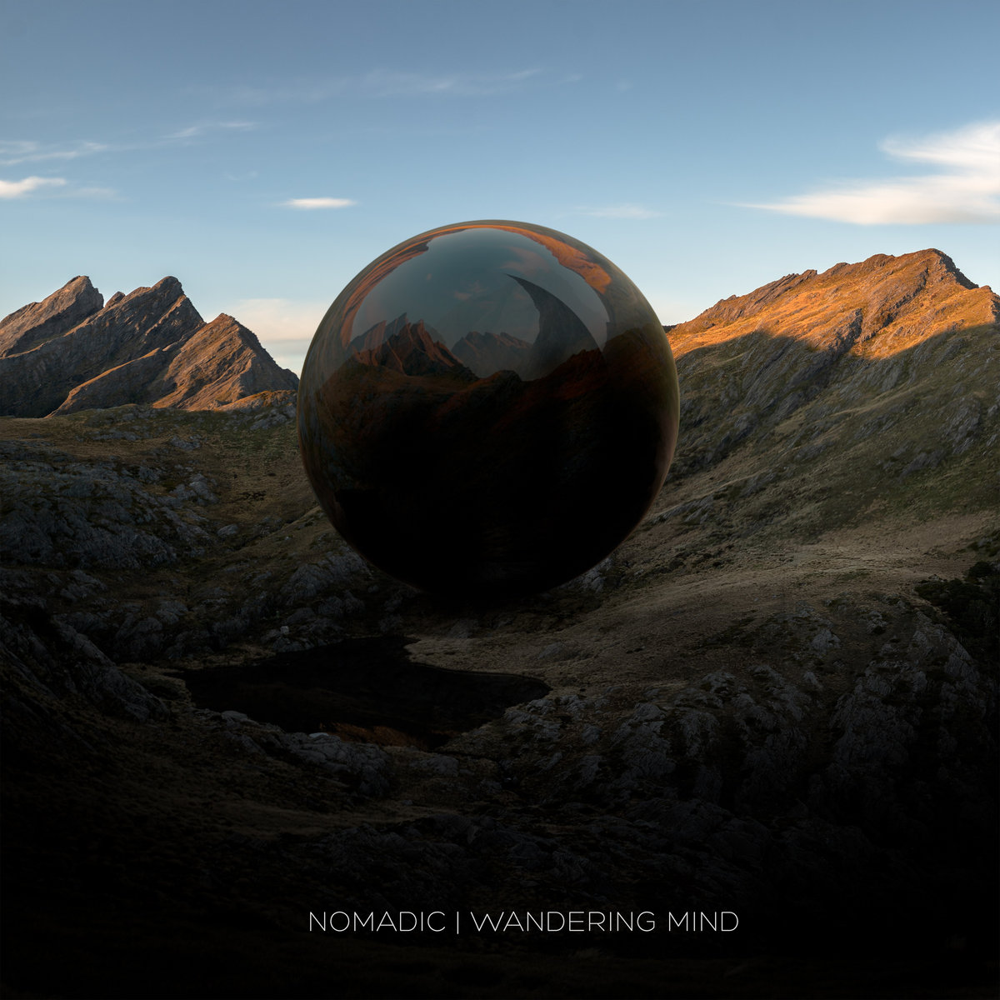
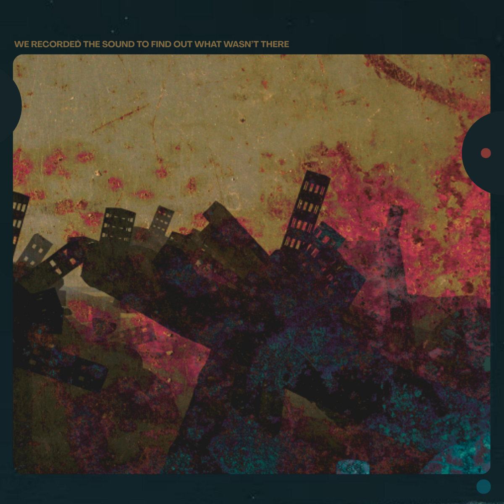

Bandcamp Friday is today, May 1st, 2026. I always like to use these opportunities to both find/support Creative Commons music and thought I'd start sharing some of my picks.

I'm running a little behind on life at the moment, so I decided to highlight three of my faves that I haven't highlighted on the blog yet. Typically I try to feature a mix music; while electronica and ambient are easy to find (they are the second and third most common tags on cc-bc respectively - "experimental" is #1), it can be tricky to find good rock, rap, and pop.

The truth though: probably 75% of the music I listen to is in the ambient/electronica realm...as long as you consider Boards of Canada "ambient". ([Hey, did you hear they have a new album coming out?](https://boardsofcanada.com/)) So here are 3 albums that blend electronic beats with ambient textures.

If you're interested in CC music, be sure to checkout the tool I made for finding CC music on BC: [cc-bc](https://handeyeco.github.io/cc-bc/).

## Under The Two Lights Of Time by CIALYN

CIALYN is easily my most listened to Creative Commons music because, for me anyway, it filled the gap left in the 13 years of no Boards of Canada releases. You'll find all the typical trademarks of hauntology: the blend of organic/electronic instruments; the warped, textural vocal samples; and the throwbacks to the analog synths that once accompanied all public access television. CIALYN is prolific, there's plenty of other albums to choose from.

- [Bandcamp link](https://cialyn.bandcamp.com/album/under-the-two-lights-of-time)
- Released in 2020
- [CC BY-NC-SA](https://creativecommons.org/licenses/by-nc-sa/4.0/)

## Wandering Mind by Nomadic

This is such a fun album - it's upbeat, energetic, and feels like being transported through space, time, and cultures. What if the world was _actually_ united, what kind of music would we make? My guess is something like **Wandering Mind**. For fans of Bonobo and Tycho.

- [Bandcamp link](https://jumpsuitrecords.bandcamp.com/album/wandering-mind)
- Released in 2019
- [CC BY-NC](https://creativecommons.org/licenses/by-nc/4.0/)

## We Recorded The Sound To Find Out What Wasn't There by Eddie Palmer

I don't know much about Eddie Palmer but I appreciate the chill beats and the wry humor found in such tracks as "Goodbye America Hello Chat GPT", "I No Longer Have A Manager I Can't Be Managed", and "LSD Made Me A Podcaster". Many tracks have a dark, dubby edge you'd might find on something by Trentemøller while others stay cinematically ambient.

- [Bandcamp link](https://eddiepalmermusic.bandcamp.com/album/we-recorded-the-sound-to-find-out-what-wasnt-there)
- Released in 2025
- [CC BY-NC-ND](https://creativecommons.org/licenses/by-nc-nd/4.0/)
