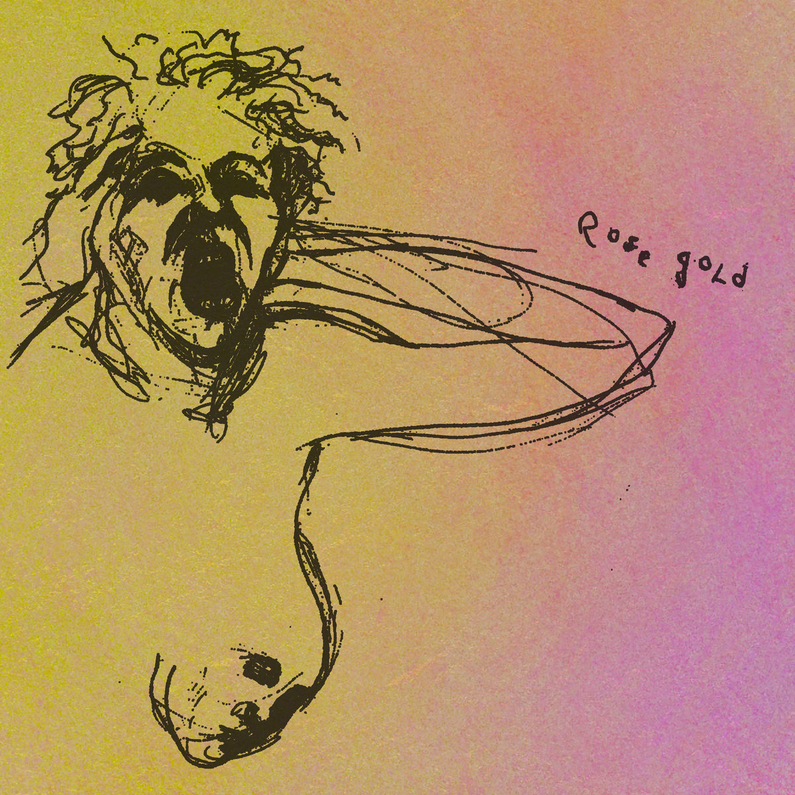
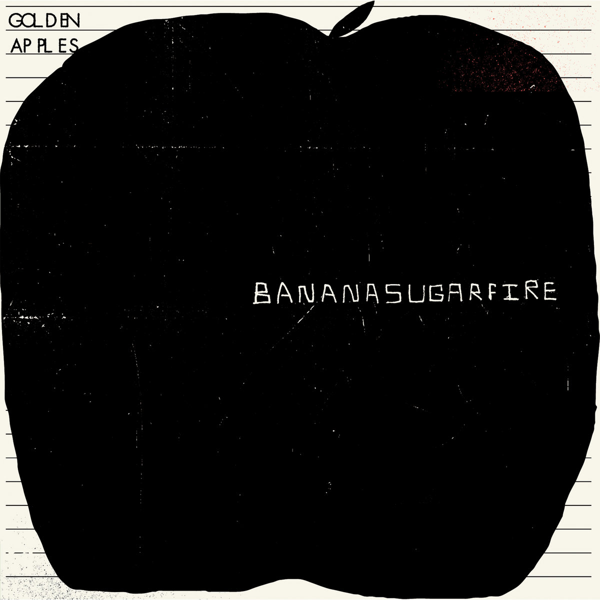

Bandcamp Friday is today, August 7th, 2026. I always like to use these opportunities to both find/support Creative Commons music and thought I'd start sharing some of my picks.

If you're interested in CC music, be sure to checkout the tool I made for finding CC music on BC: [cc-bc](https://handeyeco.github.io/cc-bc/).

## ROSE GOLD by kitty

This one is kind of hard to pin down: sounds to me like what you would get by mixing bedroom pop with 90s R&B with lofi hip-hop. **ROSE GOLD** is chill, catchy, and a little sassy. I'd personally recommend checking out the track "mami".

- [Bandcamp link](https://kitty.bandcamp.com/album/rose-gold)
- Released in 2019
- [CC BY-SA](https://creativecommons.org/licenses/by-sa/4.0/)

## Down With by The Wrong Society

I'm just always a sucker for this kind of old-school garage rock and while listening to **Down With** I couldn't help but dance. It's the classic sound we all love - raw recordings of overdriven guitars, crunchy drums, and lyrics about betrayal.

- [Bandcamp link](https://thewrongsociety.bandcamp.com/album/down-with)
- Released in 2023
- [CC BY-NC-SA](https://creativecommons.org/licenses/by-nc-sa/4.0/)

## Bananasugarfire by Golden Apples

Upbeat, guitar-driven, catchy tunes from Philadelphia. I can't shake the feeling that I've heard "Waiting For A Cloud" on KXUA (my local college radio station), but even if I haven't, the tracks on **Bananasugarfire** would be right at home on the playlist of a student about to kick off a summer roadtrip.

- [Bandcamp link](https://goldenapples.bandcamp.com/album/bananasugarfire)
- Released in 2023
- [CC BY-NC-ND](https://creativecommons.org/licenses/by-nc-nd/4.0/)
