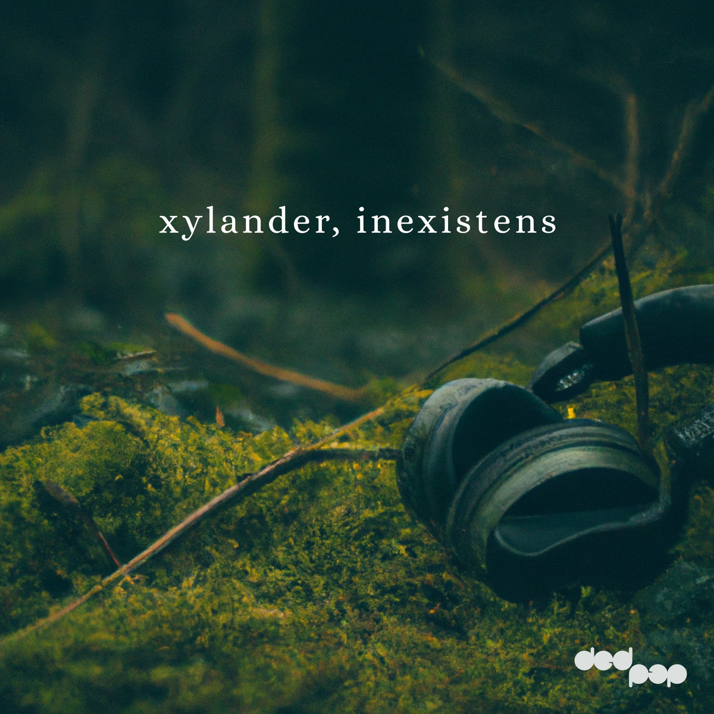
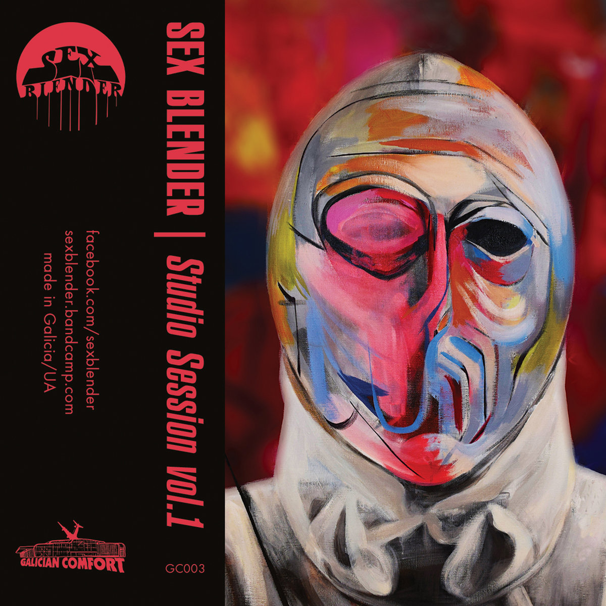

Bandcamp Friday is today, October 2nd, 2026. I always like to use these opportunities to both find/support Creative Commons music and thought I'd start sharing some of my picks.

If you're interested in CC music, be sure to checkout the tool I made for finding CC music on BC: [cc-bc](https://handeyeco.github.io/cc-bc/).

## Gone to the Mountain by Hand in the Attic

Melancholic lofi folk reminiscent of Grandaddy and Sparklehorse, **Gone to the Mountain** is a great accompaniment to a cup of tea on a rainy day.

- [Bandcamp link](https://handintheattic.bandcamp.com/album/gone-to-the-mountain)
- Released in 2020
- [CC BY-NC-ND](https://creativecommons.org/licenses/by-nc-nd/4.0/)

## Inexistens by Xylander

Clicky, textural electronica that sometimes breaks into cinematic atmospheres or aggressive big beat. **Inexistens** reminds me of Four Tet and Amon Tobin but with a unique flare for transforming mid-track.

- [Bandcamp link](https://xylander.bandcamp.com/album/inexistens)
- Released in 2023
- [CC BY-NC-SA](https://creativecommons.org/licenses/by-nc-sa/4.0/)

## Studio Session I by Sex Blender

In a similar way to how tracks on Inexistens are constantly mutating, **Studio Session I** is always towing the line between metal, space rock, and psych rock. It can get chaotic at times, but it's at its best when it hits those long hypnotic jams.

- [Bandcamp link](https://sexblender.bandcamp.com/album/studio-session-i)
- Released in 2021
- [CC BY](https://creativecommons.org/licenses/by/4.0/)
